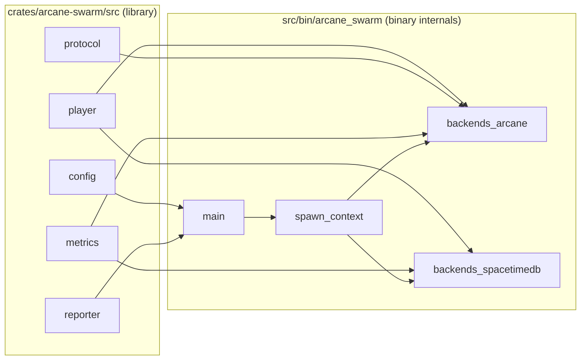

# arcane_swarm module interactions

This page describes responsibilities and boundaries inside the `arcane-swarm` crate.

## Library + binary wiring

## Responsibility summary

- `config`: normalize CLI/env inputs into one `Config` consumed by orchestration.
- `player`: deterministic movement profile shared across all backend modes.
- `protocol`: shared wire helpers for payload snippets that must stay consistent.
- `metrics`: lock-free counters and latency stats used by all loops.
- `reporter`: periodic reporting and final summary lines (`FINAL:` contract).
- `main`: process lifecycle, backend selection, control-plane wiring.
- `spawn_context`: shared spawn-time handles and per-player loop parameters.
- `backends_arcane`: Arcane manager/join + websocket loops.
- `backends_spacetimedb`: SpacetimeDB reducer/read/action loops.

## Stable contract note

External stability target is the executable contract:
- CLI flags/options
- log summary lines (`FINAL:` / `FINAL_SPACETIMEDB:`)
- backend payload behavior expected by benchmark harnesses

Internal Rust module paths are implementation details and may evolve.
